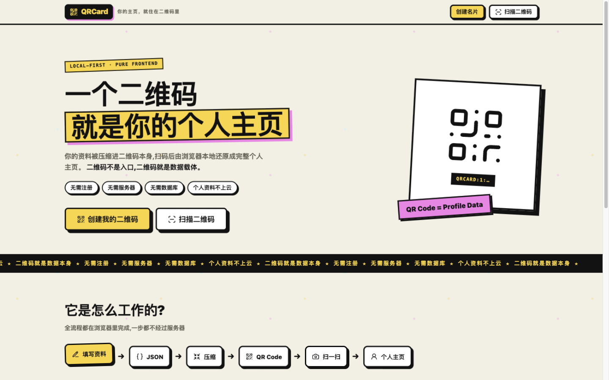
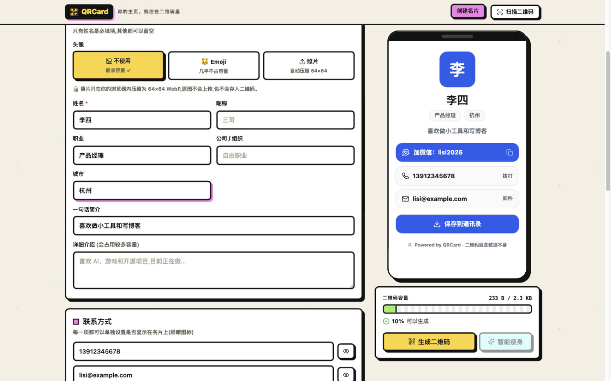
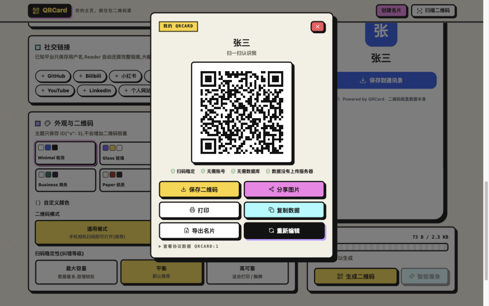
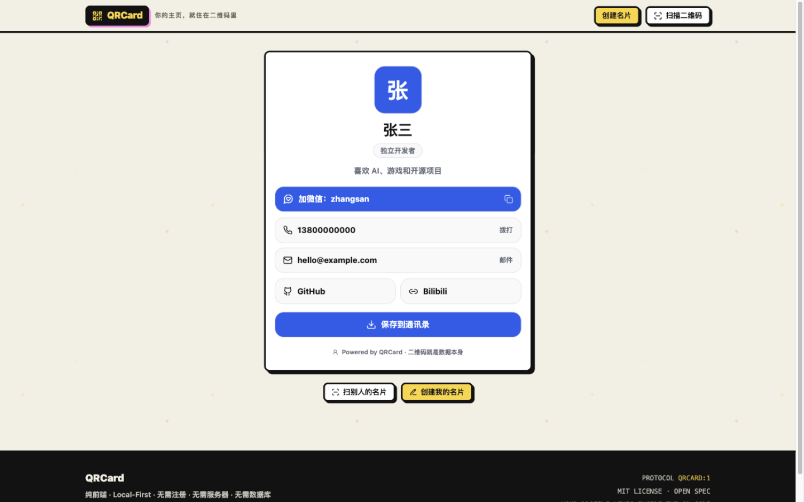

# QRCard「二维码即个人主页」

> 一个二维码，就是你的个人主页。
> **Your profile lives inside the QR code. 你的主页，就住在二维码里。**



QRCard 是一个纯前端、Local-First、无需注册和数据库的个人电子名片工具：将个人主页数据压缩进二维码，扫码后由浏览器本地还原成完整个人主页。二维码不是"个人主页的地址"，**二维码本身就是个人主页的数据载体**（`QR Code = Profile Data`）。

```text
个人资料 → 紧凑 JSON → Deflate 压缩 → Base64URL → 二维码
二维码   → 本地解码    → 解压        → JSON     → 浏览器渲染个人主页
```

## 界面预览

| 创建名片（编辑 + 实时预览 + 容量监控） | 生成二维码 | 扫码还原的个人主页 |
| --- | --- | --- |
|  |  |  |

## 功能特性

- **创建名片**：姓名（必填）、昵称、职业、公司、城市、一句话简介、详细介绍
- **头像三种模式**：
  - A 不使用（最推荐，二维码最小）
  - B Emoji 内置头像（只存 emoji 本身，几乎不占容量）
  - C 照片（浏览器本地裁剪 1:1 → 64×64 → WebP，目标 500B–1500B，原图永不上传、不入码）
- **联系方式**：手机号 / 邮箱 / 微信 / QQ / Telegram / Discord，每项可单独设置是否展示（隐藏字段不会写入二维码）
- **社交链接**：GitHub / Bilibili / 小红书 / 抖音 / 微博 / 知乎 / X / YouTube / LinkedIn / 个人网站 + 自定义链接；已知平台只存用户名，Reader 自动还原完整链接，大幅节省容量
- **双模式二维码**：
  - 通用模式（默认）：二维码内容为 `https://<域名>/#/p/QRCARD:1:<payload>`，手机相机扫码直接打开，数据全部在 URL 中，服务器不存任何数据
  - 完全离线模式：二维码内容为 `QRCARD:1:<payload>`，不依赖任何域名与服务器，用 QRCard 扫描器打开
- **容量监控**：实时显示 payload 字节数与百分比，0–40% 绿 / 40–70% 正常 / 70–90% 警告 / 90–100% 危险 / >100% 无法生成，并给出优化建议
- **智能瘦身**：超容量时一键依次执行 头像降质 → 头像 48px → 删除头像 → 精简简介 → 降低纠错等级，每步实时重算
- **扫码还原**：摄像头实时扫码（BarcodeDetector API，ZXing 动态回退）+ 图片上传识别；非 QRCard 二维码原样展示并允许打开链接，绝不误解析
- **个人主页**：8 套内置主题（Minimal / Glass / Cyberpunk / Pixel / Business / Paper / Terminal / Cute，只存主题 ID 不占容量）+ 自定义颜色；加微信一键复制、拨号 / 邮件 / 社交链接、保存到通讯录
- **保存联系人**：自动生成 vCard 3.0 `.vcf` 下载，无需服务器
- **本地草稿**：IndexedDB 多张名片草稿、自动保存、清空本地数据
- **导入 / 导出**：`.qrcard` JSON 文件，方便以后修改
- **生成结果**：保存二维码 PNG、分享海报（Canvas 本地生成）、打印（85×54mm 标准名片 `@media print`）、复制协议数据
- **PWA 离线**：Service Worker 缓存 App Shell，断网也能打开、扫码、还原名片
- **性能**：核心 JS gzip 约 79KB（目标 < 300KB），扫描库按需动态加载，无任何统计 / 广告 / 追踪

## 快速开始

```bash
git clone https://github.com/ns2250225/qr-card.git
cd qr-card
npm install        # 已配置 .npmrc，默认使用国内源 registry.npmmirror.com
npm run dev        # 开发服务器 http://localhost:5173
```

```bash
npm run build      # 生产构建 → dist/
npm run preview    # 本地预览生产构建
npm run icons      # 重新生成 PWA 图标
npm run typecheck  # TypeScript 类型检查
```

## 部署

构建产物 `dist/` 使用相对路径（`base: './'`）+ Hash 路由，可零配置部署到：

- GitHub Pages / Cloudflare Pages / Vercel / Netlify
- 任意 Nginx / Apache 静态目录
- 甚至直接双击打开 `dist/index.html`（file:// 协议可用）

无需服务器、数据库、云函数、用户系统。

## 技术栈

Vue 3 + TypeScript + Vite · Tailwind CSS v4 · Lucide Icons · qrcode · ZXing（@zxing/library，动态加载）· Compression Streams API（pako 回退）· IndexedDB · Service Worker / PWA

界面整体采用 **Neo Brutalism（新粗野主义）** 风格：粗黑边框、硬阴影、高饱和色块、方角与沉重字重；名片本身的视觉由所选主题决定。

## 项目结构

```text
qrcard/
├── public/                 # manifest / sw.js / favicon / PWA 图标
├── scripts/gen-icons.mjs   # PWA 图标生成脚本（纯 Node，无依赖）
├── src/
│   ├── components/         # 编辑器 / 名片渲染 / 容量条 / QR 生成 / 扫描器
│   ├── pages/              # Home / Create / Scan / Profile
│   ├── protocol/           # QRCARD:1 协议：schema / serialize / deserialize / compress / encode
│   ├── qr/                 # 二维码生成、容量计算、摄像头与图片扫描
│   ├── profile/            # 头像压缩、vCard、分享海报、安全过滤
│   ├── themes/             # 8 套内置主题
│   ├── storage/            # IndexedDB 本地草稿
│   └── router.ts / App.vue / main.ts
├── PROTOCOL.md             # QRCard 协议规范（开放）
└── vite.config.ts          # base:'./'，任意静态目录可部署
```

## 隐私与安全

🔒 **所有数据只在你的设备中处理**。QRCard 不上传姓名、手机号、邮箱、微信、头像、社交账号——**二维码就是数据本身**。

- 二维码数据视为不可信输入：所有字段以 `textContent` 语义渲染，杜绝 XSS
- URL 白名单仅放行 `https:` / `http:` / `mailto:` / `tel:`，禁止 `javascript:` 等危险协议
- 头像仅接受 `data:image/(png|jpeg|webp);base64`，逐字段长度截断与校验

⚠ 二维码一旦分享，任何能读取它的人都可能获取其中的信息。请不要写入身份证号、家庭住址、密码、密钥等敏感信息。

## 协议

见 [PROTOCOL.md](./PROTOCOL.md)。协议版本化（`QRCARD:1:`），一旦发布不做破坏性修改——目标是 **10 年后的 Reader 仍然能够读取今天生成的二维码**。

开放规范，MIT License，欢迎第三方实现自己的 Reader（Android / iOS / CLI / 浏览器扩展），形成开放生态。

## License

[MIT](./LICENSE)
